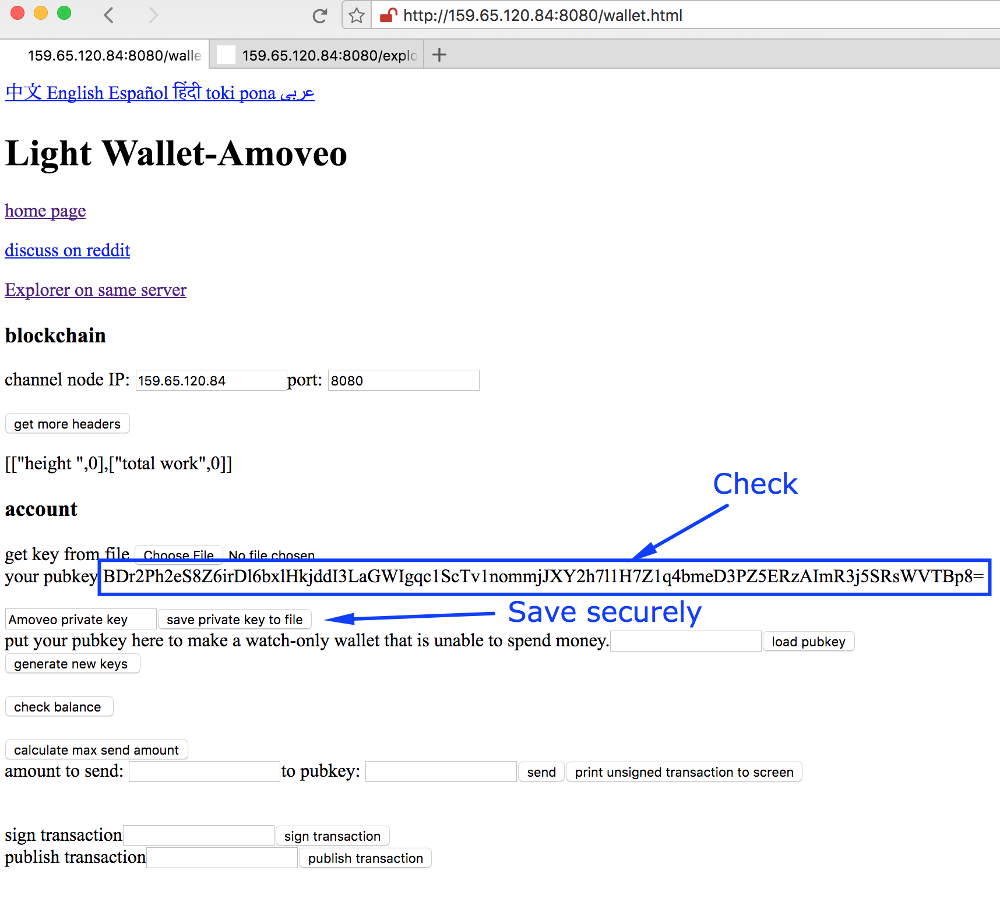
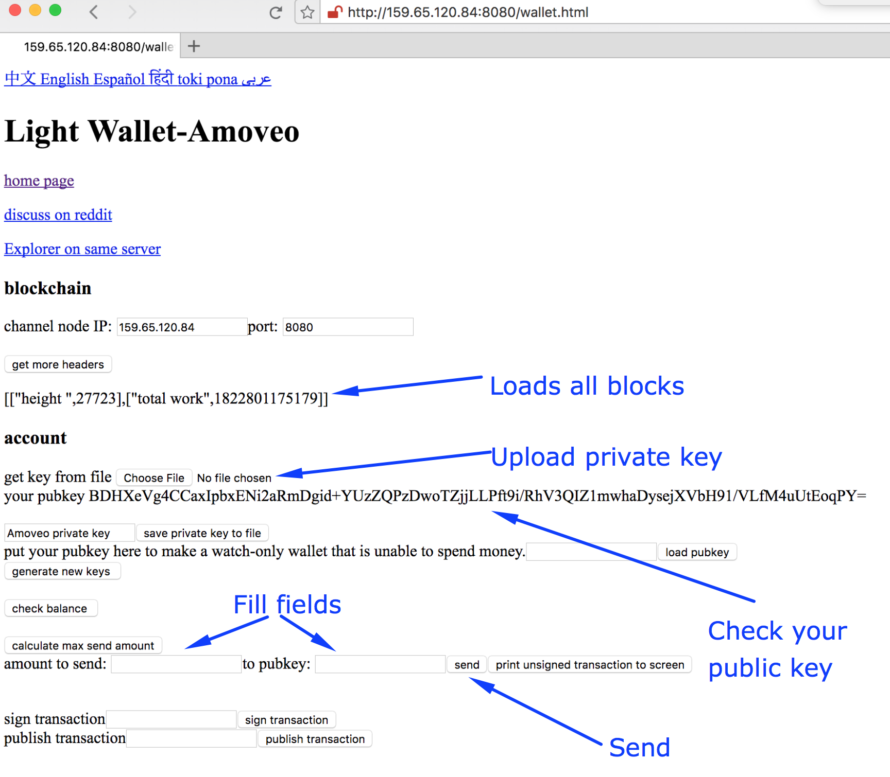
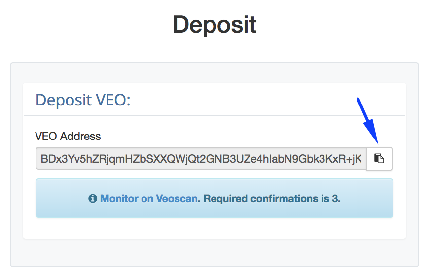
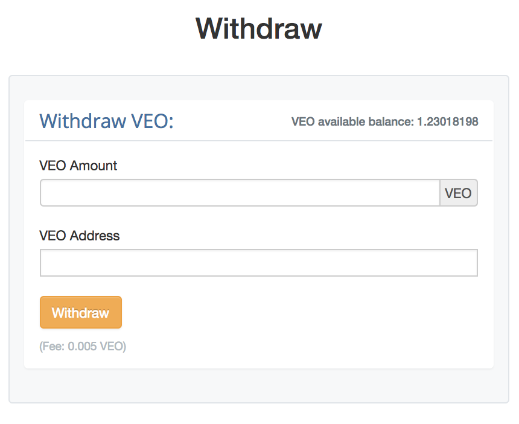

#Create Veo Wallet

1. Go to [Zacks wallet - http://159.65.120.84:8080/wallet.html] (http://159.65.120.84:8080/wallet.html). Make sure this is the link and your not giving away your private key to someone. You can do this by accessing the wallet through [amoveo github page](https://github.com/zack-bitcoin/amoveo).

2. The wallet automatically generates you a private/public key. If you don't like your public key refresh the page. If you like your public key, click on "save private key to file" and make sure to save it securely.  

#Deposit Veo

1. Go to [Zacks wallet - http://159.65.120.84:8080/wallet.html] (http://159.65.120.84:8080/wallet.html). Make sure this is the link and your not giving away your private key to someone. You can do this by accessing the wallet through [amoveo github page](https://github.com/zack-bitcoin/amoveo).

2. Wait until the wallet loads all blocks. It shows loads them 5000 at a time so you'll know it is loaded when height isn't a number devisible by 5000. 

3. Upload your private key
4. Check if your public key is correct. You can also track the history of your account by copy pasting your public key to [veoscan](http://veoscan.io/).

5. Enter the amount you want to send. Make sure to leave some veo for the TX fee. Current fee is 0.00061657 VEO for sending and 0.00152118 VEO for creating an account. If the address you send doesn't have any VEO you will need to send create account fee. You can check out the most recent fees [here](https://veoscan.io/txs).

6. Copy & Paste the pubkey which is given to your account in the [deposit section](https://amoveo.exchange/deposit/index).  

7. Press send.
8. Check if your tx has been sent by using the explorers below. They may not be up to date so make sure to tech your tx in a few of them. 
	- [Sys Explorer](http://78.46.149.239:8080/explorer.html)
	- [Ips Explorer](http://45.77.8.119:8080/explorer.html)
	- [Zacks Explorer](http://159.89.106.253:8080/explorer.html)
	- [Amoveopool2 Explorer](http://159.65.173.9:8080/explorer.html)
	- [Zacks Mining Pool Explorer](http://159.65.120.84:8080/explorer.html)

	If you saw your tx is on the way continue. If not, ask try again or ask in [telegram](https://t.me/amoveo) or [discord](https://discord.gg/xJQcVaT) group. 

9. Wait for the next block to be mined to see it on [veoscan](https://veoscan.io/blocks).

10. Wait for the required amount of blocks to be mined before having your account credited.

#Withdraw Veo

1. Find your Veo address. 
2. Go to your [withdraw screen](https://amoveo.exchange/withdraw/index). 
3. Copy your address.
4. Enter the amount of Veo you want to withdraw.
5. Click "Withdraw"
6. Check your withdraw status from [veoscan](http://veoscan.io/)

 

#Deposit Ether

######TODO

#Withdraw Ether

######TODO